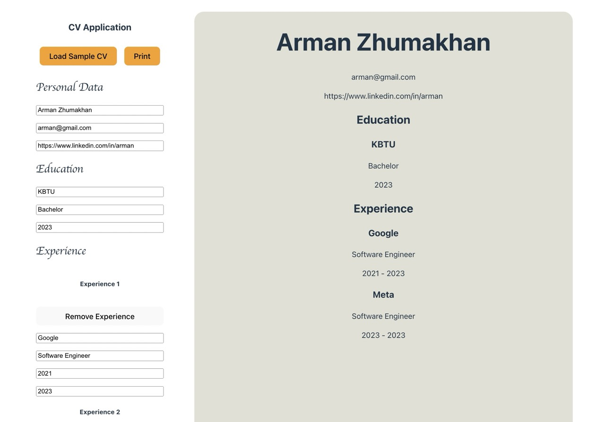

# CV Application

The CV Application project is an assignment from the React course in **The Odin Project** [course](https://www.theodinproject.com/paths/full-stack-javascript/courses/react)

The Project is built using React, HTML, CSS.

## Getting Started
1. `git clone {github-link}`
2. `cd cv-application`
3. `npm install`
4. `npm start`

### Local development
- `npm run dev`

